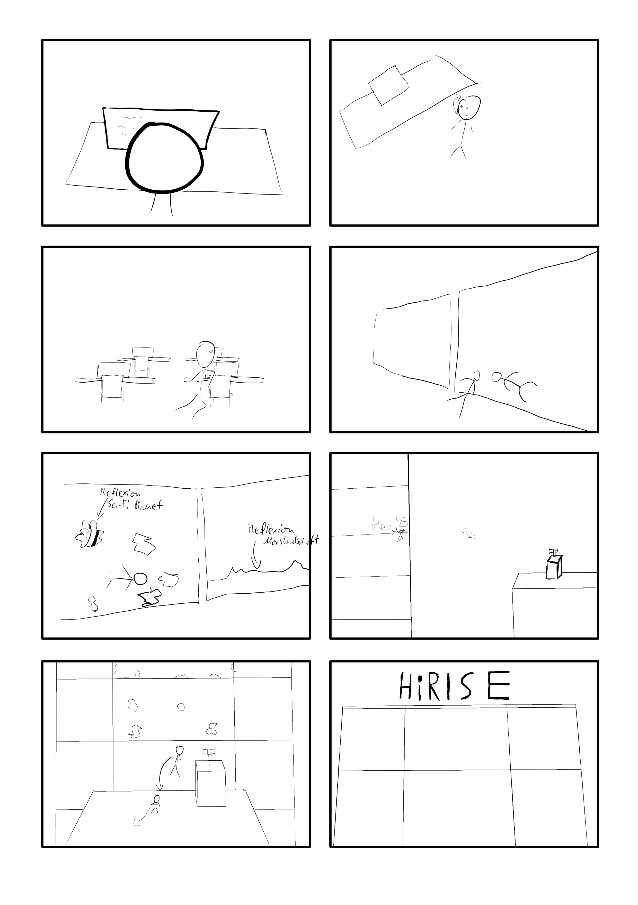

#HiRISE
Lukas Sabatschus
##Story
Der Protagonist steht von seinem Schreibtisch auf und schaut sich um - es starten Sirenen und er fängt an zum Fenster zu laufen.
Auf dem Weg dahin wird er von mehreren Personen verfolgt und macht etwas Parkour über Tische und andere Hindernisse.
Er bricht durch das Fenster und man sieht das Gebäude von außen, welches sich auf einem Science-Fiction Mars befindet und springt auf ein gegenübergelegenes Haus und läuft weg.

##Storyboard

##Technisches
###Features zu implementieren
- Minimalistische Cinematic Engine
    - Datenformat aus Blender exportieren, in Programm importieren
    - protobuf oder json als Dateiformat?
    - Kameraposition, Skelettanimationen
- Rigging für Charaktere
    - muss sehr gut funktion, um realistische Bewegungen zu erlauben
- Physikalische Simulation der Glassplitter
    - kann auch in Blender vorsimuliert werden, sollte es nicht in echtzeit möglich sein
- Reflexion im Glas
    - Zunächst bei intakter Scheibe durch duplikation der Szene unsetzbar
    - Bei vielen Glassplittern andere Technik notwendig
    - z.B. SS (unvollständig), Ray-tracing (zu teuer), Environment Map
- Dispacement Mapping + PDS Parser
    - Höhendaten und Bilder von Marsoberfläche aus PDS Daten laden
    - Marsoberfläche von HiRISE-daten
- Sound
    - Etwas Musikunterlage
###Optionale Features
- Dynamische Subdivision Surface der Marsoberfläche
    - Erhöht sowohl Performance, als auch Qualität
    - Kann auch vorberechnet werden, da die Kamera im Verhältnis zur Oberfläche fast statisch ist
- Prozedurale Texturen für Mars-oberfläche
    - Farben für Flächen, auf denen die HiRISE Kamera keine Farbinformationen erhalten hat
- HDR-Effekte, Bewegungsunschärfe, Fokusunschärfe
    - Qualität erhöhen, wenn noch Zeit und Performace über ist (Priorität absteigend)