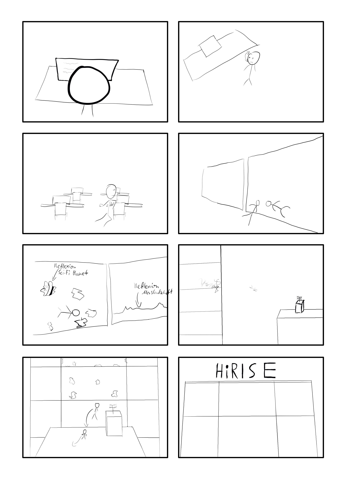
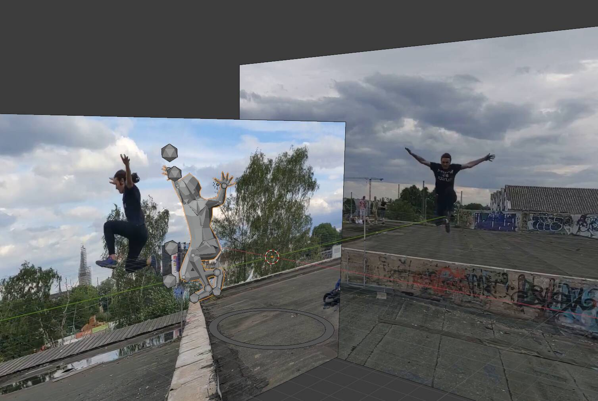
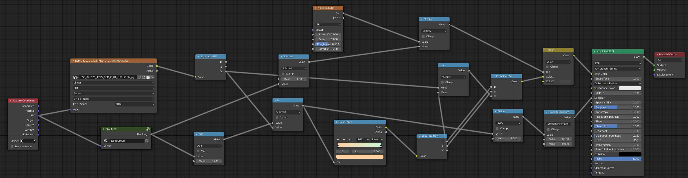
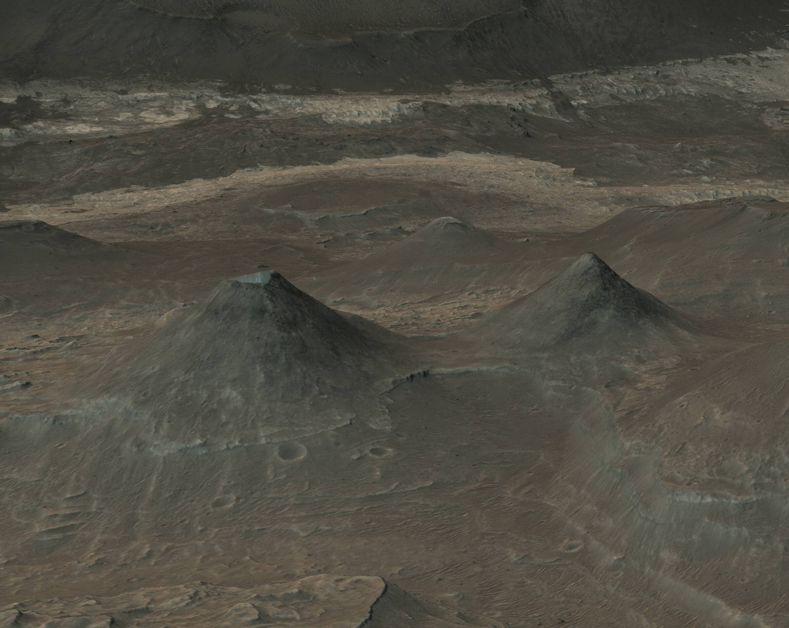
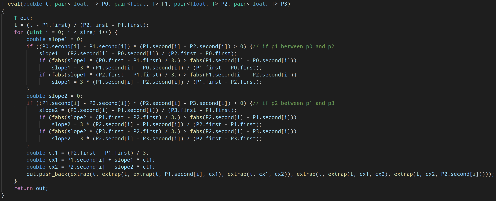
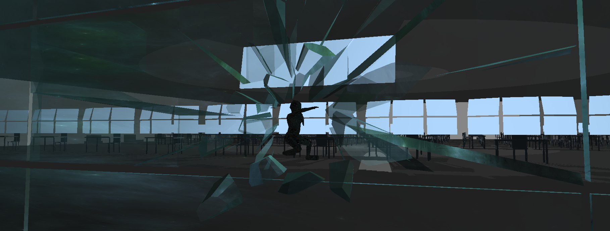

# Arbeitsschritte für HiRISE
Der gesamte code ist auf [GitHub.com/luksab/HiRISE](https://github.com/luksab/hirise) zu finden
# Planung

### Storyboard

### Story
Der Protagonist steht von seinem Schreibtisch auf und schaut sich um - es starten Sirenen und er fängt an zum Fenster zu laufen.
Auf dem Weg dahin wird er von mehreren Personen verfolgt und macht etwas Parkour über Tische und andere Hindernisse.
Er bricht durch das Fenster und man sieht das Gebäude von außen, welches sich auf einem Science-Fiction Mars befindet und springt auf ein gegenübergelegenes Haus und läuft weg.

### Technisches
#### Features zu implementieren
- [x] Minimalistische Cinematic Engine
    - [x] Datenformat aus Blender exportieren, in Programm importieren
        - einfach dae/obj
    - [x] protobuf oder json als Dateiformat? - Custom (floats in Datei, space-separated)
    - [x] Kameraposition, Skelettanimationen
        - [x] Kameraposionen speichen
- [x] Rigging für Charaktere
    - [x] muss sehr gut funktion, um realistische Bewegungen zu erlauben
- [ ] Physikalische Simulation der Glassplitter
    - kann auch in Blender vorsimuliert werden, sollte es nicht in echtzeit möglich sein
- [x] Reflexion im Glas
    - [x] Zunächst bei intakter Scheibe durch duplikation der Szene unsetzbar
    - [ ] Bei vielen Glassplittern andere Technik notwendig
        - [x] Environment Map reflektieren
        - [ ] Environment Map in realtime neu erzugen
    - [x] z.B. SS (unvollständig), Ray-tracing (zu teuer), Environment Map
- [x] Dispacement Mapping + PDS Parser
    - [x] Höhendaten und Bilder von Marsoberfläche aus PDS Daten laden
    - [x] Marsoberfläche von HiRISE-daten
- [ ] Sound
    - Etwas Musikunterlage
        - [x] Code
        - [ ] Musik selbst
#### Optionale Features
- [x] Dynamische Subdivision Surface der Marsoberfläche
    - Erhöht sowohl Performance, als auch Qualität
- [ ] Prozedurale Texturen für Mars-oberfläche
    - [x] Farben für Flächen, auf denen die HiRISE Kamera keine Farbinformationen erhalten hat
- [ ] HDR-Effekte, Bewegungsunschärfe, Fokusunschärfe
    - [ ] Qualität erhöhen, wenn noch Zeit und Performace über ist (Priorität absteigend)

# Durchführung
## Charakteranimation
Um die animation des Charakters realistisch zu gestalten wurden Referenzvideos aufgenommen, die dann in Blender als Hintergrund benutzt wurden, um dann mithilfe von inverse kinematics zu animieren.

Die Referenzvideos sind mit der expliziten Erlaubnis von Ben Karcher aufgenommen und verwendet.

## Marsoberfläche
Da als Umgebung eine Marsoberfläche gewünscht wurde, werden Höhendaten und ein Schwarz-Weiß Bild vom High Resolution Imaging Science Experiment (HiRISE, daher stammt auch der Projektname) benutzt.
Der genaue Datensatz lässt sich unter https://www.uahirise.org/dtm/dtm.php?ID=ESP_048136_1725 finden.

Um aus den Höhendaten und dem Schwarz-Weiß Bild ein 3D-Objekt mit Farben zu erstellen wurde ein Referenzbild in Farbe benutzt, um ein Node-Netzwerk in Blender anzupassen, um nahe an das Referenzbild zu gelangen.

In Blender lassen sich in Echtzeit Parameter und Zusammenhänge ausprobieren um schnell zu iterieren und so zu einer Lösung zu kommen. Dieses Node-Netzwerk wurde dann in Shader-Code umgesetzt.

### Mars in HiRISE gerendered

## Kamera und UI
Hier ist die Entwicklungsumgebung mit allen UI-Elementen aktiviert:

Zur Entwicklung des Benutzerinterfaces wurde dear ImGui benutzt. Dies erlaubt schnell relativ komlexe Bedienelemente einzubinden.
Die Entwicklung der einzelnen Elemente fand zum Großteil dadurch statt, dass eine Variable im Programm in Echtzeit verändert werden sollte, wodurch dann genau ein Element nötig wurde.
Da diese Element jeweils also genau einen Verwendungszweck habem , lassen sie sich jeweils deaktivieren, um Platz zu sparen.

## Kamerafahrt
Diese wird mithilfe von Splines, welche durch Punkte, durch die die Kamera gehen soll definiert werden.
Hier ist die erste Kamerafahrt. Bei dieser sind die Tangenten noch nicht korrekt gesetzt, weswegen sie etwas abgehackt erscheint.
<figure class="video_container">
  <video controls="true" allowfullscreen="true">
    <source src="./videos/first Cam.mp4" type="video/mp4">
  </video>
</figure>

Die Punkte, durch die die Kamera gehen soll, werden in einem nach dem ersten Element von dem std::pair sortierten std::vector<std::pair<float, std::vector\<float>>> gespeichert. Es wird, um zwischen dem iten und (i+1)ten Punkt eine Kurve auszurechnen werden die Punkte i-1, i, i+1 und i+2 mit der globalen Zeit an [eval](https://github.com/luksab/HiRISE/blob/486d4ef89b60513d377432117c05703218515664/Code/include/spline.hpp#L150) übergeben.
Diese rechnet dann zunächst die Steigungen der Kontrollpunkte von den Punkten p1 und p2 aus aus, welche p2-p0 und p3-p1 normiert entsprechen, wenn p1 zwischen p0 und p2 und p2 zwischen p1 und p3 liegt. Sonst werden die Kontrollpunkte auf die x-Koordinate beschränkt.
Dies wird gemacht, damit Maxima und Minima eine symmetrischere Extremstelle aufweisen.

## PBR & HDRI
Außerhalb des Gebäude wird zur beleuchtung ein HDRI nach dem Vorbild von https://learnopengl.com/PBR/IBL/Specular-IBL benutzt.
Außerdem werden die dort beschriebenen shader leicht verändert für die PBR-Objekte verwendet.

## Skeletal animation
Das importieren von Skeletal Animationen hat sich als recht fragil herausgestellt und bei Exporteinstellungen, die von denen abweichen, die in [blenderExport](blenderExport.md) beschrieben werden, geht das Modell fast sicher kaputt.
<figure class="video_container">
  <video controls="true" allowfullscreen="true">
    <source src="./videos/brokenSkelett.mp4" type="video/mp4">
  </video>
</figure>
Es werden die einzelnen Knochen rekursiv von der Hüfte aus importiert, indem die Transformationsmatrizen pro frame immer an die Kinder weitergegeben werden. Dadurch werden, wenn z.B der Arm bewegt wird die Hand und dadurch auch die Hand mitbewegt.

Hier ist der Anfang in Blender Animiert:
<figure class="video_container">
  <video controls="true" allowfullscreen="true">
    <source src="./videos/animationFromScratch.mp4" type="video/mp4">
  </video>
</figure>

## Spiegelung
Für den großen Spiegel mit Echtzeitreflexionen wird die Szene zwei mal gerendert. Ein mal normal und ein mal gespiegelt und mit einem Stencil auf die richtige Form zurechtgeschnitten. Dies geschieht in der main datei um Zeile [832](https://github.com/luksab/HiRISE/blob/master/Code/src/main.cpp#L832).

Für die vielen kleinen Glasscherben wird lediglich die Environment Map reflektiert abgebildet. Dies geschieht vollständig im [shader code](https://github.com/luksab/HiRISE/blob/master/Code/shaders/glass/glass.frag).

## Modelle
### Mars
Da die Marsoberfläche vollständig aus Texturen entsteht, muss nur ein relativ hochaufgelöstes Quadrat eingeladen werden.
Diese muss bereits einiges an Auflösung aufweisen, da meine Nvidia gtx 1070 ti leider nur 64 Tessellation levels unterstützt, was nicht ausreicht, um aus einem einzelnen Rechteck genug Detail herauszuhohlen.
Die Farbtextur wird in einem Computeshader vorberechnet um zur Laufzeit Rechenleistung zu sparen. Dadurch lässt sich in der Szene beim Zeitpunkt der [Implementation](https://github.com/luksab/HiRISE/commit/5c31de87f14faa08e156b4710158d1e16780ce2e) eine Performacesteigerung von nahezu 10x feststellen, da das berechnen der Farbinformationen sehr aufwendig ist.

### Tisch, Stuhl, Bildschirm, USB-Stick
Diese Objekte wurden alle von mir in Blender modelliert, in dem Primitive zu einem Mesh zusammengefügt und dann teilweise leicht verändert wurden.

### HiRISE Text
Der text wurde in Blender mithilfe des Text-Objektes ertellt. Dieses kann dann in Geometrie umgewandelt werden, die dann extrudiert wird, um ein dreidimensionales Objekt des ursprünglichen Textes zu erstellen.

## Glasssplitter simulation
Der ursprüngliche Plan war es eine vollständige Simulation von Glass zu schreiben, die das Glas zersplittern und mit der Szene interagieren lassen sollte. Dies ist allerdings aus Zeitgründen nicht gelungen und wird jetzt durch das Blender Add-on [Cell Fracture](https://docs.blender.org/manual/en/2.83/addons/object/cell_fracture.html) und die Ridgid Body Simulation von Blender ersetzt.
Dort wird das Glas zunächst von Cell Fracture zersplittert und die einzelnen resultierenden Objekte interagieren dann miteinander und mit der Szene.

