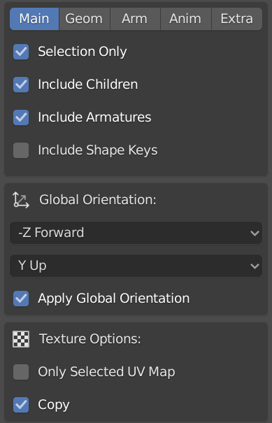
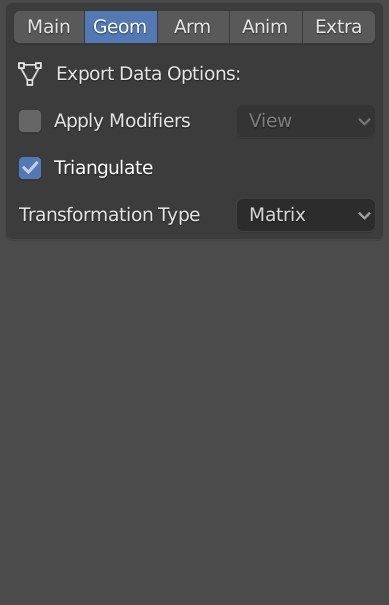
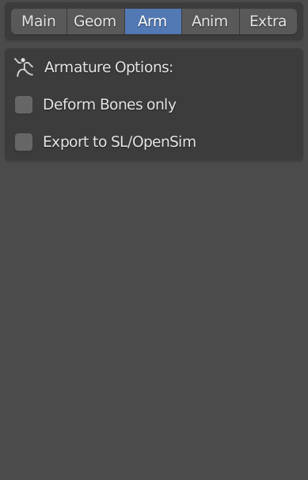
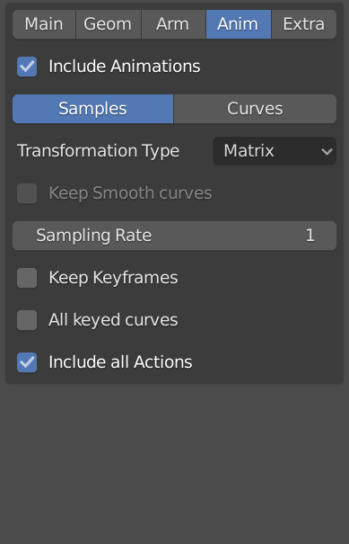
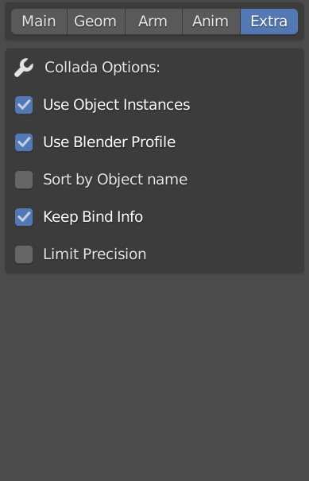

#Importing models with skeletal animaton from blender
The recommended way to import a model to HiRISE with any animation is to export from blender using Collada and the following settings (using other settings will probably break in the application importer):

    
